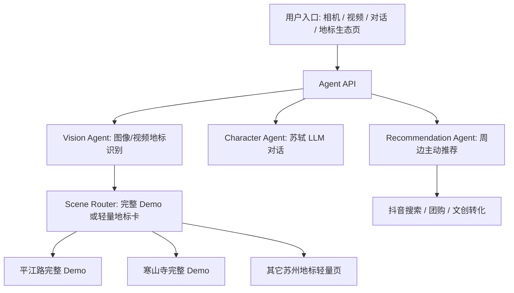

# Agent 架构说明

## 总体链路

## 为什么这样拆

视觉搜索赛道强调“看见之后继续理解和互动”。因此这里不是把模型当作单次识别工具，而是拆成四个可组合 Agent：

1. `Vision Agent` 判断画面或视频中是否存在苏州关键地标，并给出证据。
2. `Scene Router` 决定进入完整互动 Demo，还是返回轻量地标介绍卡。
3. `Character Agent` 负责苏轼等 NPC 的人格化回答。
4. `Recommendation Agent` 在用户进入地标页后主动推荐可消费内容，形成商业闭环。

## 当前实现

- 平江路：相机识别后进入完整 Demo。
- 寒山寺：视频识别后进入完整 Demo。
- 虎丘、胥门、山塘街、拙政园、留园、金鸡湖、苏州博物馆、同里、周庄：先返回轻量介绍卡，后续可扩展成完整主题页。
- 不在内置列表但被模型判断为苏州地标的内容，会返回 `open_suzhou`，用于知识库/联网搜索兜底。
- 苏轼对话：配置 `MIMO_API_KEY` 后走 MiMo 文本模型；未配置时走本地三类兜底话术。
- 推荐：配置 `MIMO_API_KEY` 后可根据用户偏好排序候选商品；未配置时返回本地候选。

## 下一步接入前端

静态 Demo 已复制在 `public/` 下。后续可在现有交互点接入：

- 相机拍摄后，将截图转为 `data:image/png;base64,...` 调用 `/api/recognize/camera`。
- 寒山寺视频页点击吉祥物后，抽取当前视频帧或发送短视频片段调用 `/api/recognize/video`。
- 苏轼对话页，把用户输入发送到 `/api/chat/sushi`。
- 平江路/寒山寺主题页加载后，调用 `/api/recommendations` 获得主动推荐卡。

这样前端体验保持原有美术和动效，后端逐步替换为真实 Agent 能力。
